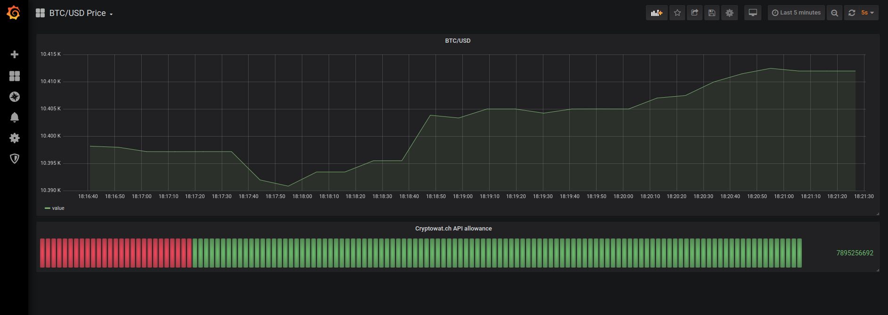

# Franz Ivan

Implementing a system that collects prices of traded cryptocurrency pairs from Cryptowat.ch API and
passes the events through Aiven Kafka instance to Aiven PostgreSQL database.

Aiven is a Database as a Service vendor.

Application components are built in Python, container technology is Docker, deployment orchestration is either Docker Compose or Kubernetes.

## What it does?
`kafka_producer` connects to Cryptowat.ch API and retrieves current price value of a traded cryptocurrency pair. The value is published into the Kafka topic `crypto_prices`.

`kafka_consumer` is listening to the Kafka topic `crypto_prices` and records the price time series into a PostgreSQL database called `crypto_prices`, where a table is created for the specific crypto pair (i.e. `btcusd`).

Because the Cryptowat.ch public API implements call allowance, `kafka_producer` and `kafka_consumer` are recording this information too in a separate table `cryptowatch_api_allowance`.

Both the price and the allowance metric can be displayed via Grafana instance.

## How to deploy?

Go to https://aiven.io, register and create your Kafka and PostgreSQL service.

### Docker Compose

_prereqs: Docker, Docker Compose_

clone the repo:

`$ git clone git@github.com:squeaky-godzilla/franz-ivan.git`

inside the repo directory, copy your `ca.pem`, `service.cert` and `service.key` into the `./tmp/access/` directory.

update the `./env/franz-ivan.env` file with details of your infrastructure.

build and deploy the app:

`$ docker-compose up --build`

### Kubernetes

_prereqs: installed and configured kubectl_

add your base64 encoded `ca.pem`, `service.cert`, `service.key` strings into the prepared secrets template `ssl.yml`.

update the `ssl.yml` with your credentials encoded in base64.

update the `k8s-deployment.yml` with the details of your deployment. you can choose to use my containers, or build your own.

create the secrets resource in Kubernetes:

`$ kubectl create -f ssl.yml`

create the deployment:

`$ kubectl create -f k8s-deployment.yml` 

### Grafana

in addition to the above, you can set up Grafana instance to monitor the metrics, you can use the dashboard template in the `./grafana/` folder in the repo.

## How does it work?

both components use the `kafka-python` library to set up connection to the Kafka broker with SSL authentication. Keys are supplied via Docker volume mount in Docker Compose deployment or as a Kubernetes secret in Kubernetes deployment.

The PostgreSQL connection is handled by `psycopsg2` library for Python. The records are timestamped upon recording to the database via PostgreSQL native timestamping function `CURRENT_TIMESTAMP()`.

### Docker hacks

I've simplified the `docker-compose` config by mounting a volume with `.env` file for loading the environment variables.

